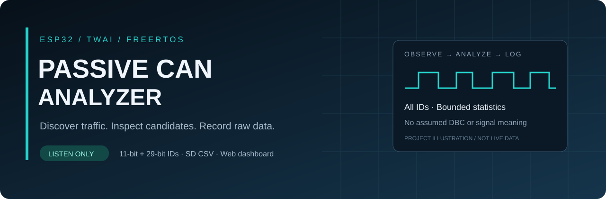
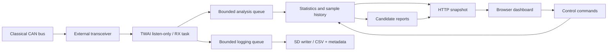

<div align="center">



# ESP32 Passive CAN Data Logger Dashboard

**A passive Classical CAN explorer and SD data logger for ESP32, with an embedded web dashboard.**


[Overview](#overview) · [Features](#features) · [Getting started](#getting-started) · [Hardware map](#hardware-map) · [Data logging](#data-logging) · [Web demo](https://poommyroboticcamera-netizen.github.io/DATA-logging-dashboard-CANBUS/) · [Validation](VALIDATION.md)

<sub>ภาพปกเป็นภาพประกอบโปรเจกต์ ไม่ใช่ผลการรับ CAN จากฮาร์ดแวร์</sub>

</div>

---

## Overview

โปรเจกต์ PlatformIO สำหรับสำรวจและบันทึก Classical CAN ด้วย ESP32 และ CAN transceiver ภายนอก โดยออกแบบหน้าตาและ workflow จาก `DATA-Logging-Dashboard-esp32` แต่เป็น CAN-only และไม่มีโมดูลเซนเซอร์เสริม

เปิดหน้าเว็บผ่าน Wi-Fi เพื่อดู traffic, เลือก bitrate, วิเคราะห์ ID และเปรียบเทียบ baseline กับการทดลอง ระบบรายงานเป็น candidate เพื่อช่วยคนวิเคราะห์ โดยไม่สมมติยี่ห้อรถ, DBC หรือความหมายของ signal

หน้าเว็บถูกฝังใน firmware และใช้งานกับ ESP32 ในเครือข่ายท้องถิ่น นอกจากนี้ repository มี [Web Demo สำหรับ ESP32](https://poommyroboticcamera-netizen.github.io/DATA-logging-dashboard-CANBUS/) ที่ใช้ข้อมูลจำลองเพื่อดู layout, บันทึก session และดาวน์โหลด CSV ได้โดยไม่ต้องต่อฮาร์ดแวร์ โดยต้องเปิดใช้ GitHub Pages ของ repository ก่อน

## Project at a glance

| Capability | Implementation | Default |
|:--|:--|:--|
| CAN reception | TWAI listen-only, accept all IDs | Driver off at boot |
| Frame formats | Standard / Extended, DATA / RTR | Classical CAN, DLC 0–8 |
| Bitrate | Runtime selection while CAN is off | 500 kbit/s |
| Analysis | Byte/bit statistics and signal candidates | 16 traffic records |
| History | Bounded samples per record | 32 recent frames |
| Experiments | Baseline versus labelled action | 10 seconds |
| Recording | Independent queue → SD task → CSV | Started by operator |
| Interface | Embedded web dashboard and Serial | Wi-Fi / 115200 baud |

## Features

| Traffic discovery | Candidate analysis | Capture and diagnostics |
|:--|:--|:--|
| Standard 11-bit and Extended 29-bit IDs | Bit, 8/16/24/32-bit field hypotheses | Asynchronous raw SD CSV |
| DLC, count, first/last seen and periods | Intel / Motorola interpretations | Baseline and experiment comparison |
| Byte range, mean, variance and changes | 2/4/8/16-bit rolling counters | Driver state and last-frame age |
| XOR masks and bit toggles | Checksum / CRC-location evidence | Queue drops and database-full counts |

## System architecture



CAN RX เป็น task ความสำคัญสูงสุดในกลุ่มงานของ analyzer และไม่รอการเขียน SD หรือการแสดงผล ส่วนงานวิเคราะห์และบันทึกข้อมูลใช้คิวจำกัดขนาด การพบ ID ไม่ได้หมายความว่าพบ ECU หนึ่งตัว

## Safety contract

- CAN driver ไม่ทำงานตอน boot
- เปิดจากหน้า CAN Analyzer หรือคำสั่ง Serial `CAN ON`
- TWAI ถูกติดตั้งด้วย `TWAI_MODE_LISTEN_ONLY` เท่านั้น
- transmit queue เป็นศูนย์ และ firmware ไม่มี `twai_transmit()`
- ไม่มีคำสั่งส่ง frame, diagnostic request หรือเปลี่ยนเป็น active mode
- รองรับ Classical CAN เท่านั้น ไม่รองรับ CAN FD

Firmware passivity ไม่ทดแทน hardware safety: ตรวจรุ่น transceiver, logic voltage, standby/silent pin, TX/RX, ground, bitrate และพฤติกรรมช่วง boot/reset ก่อนต่อรถจริง

## Hardware map

| Connection | ESP32 GPIO | Purpose |
|:--|:--|:--|
| Transceiver D / TXD | 25 | TWAI TX connection |
| Transceiver R / RXD | 26 | TWAI receive input |
| SD CS | 5 | Card select |
| SD SCK / MISO / MOSI | 18 / 19 / 23 | SPI storage |

ตรวจ wiring ให้ตรงกับบอร์ดจริง ค่าเริ่มต้นอยู่ใน [Config.h](src/can/Config.h)

- CAN TX: GPIO25
- CAN RX: GPIO26
- Bitrate: 500 kbit/s (เลือก 50/100/125/250/500/1000 จากหน้าเว็บได้ขณะ CAN ปิด)
- SD: CS5, SCK18, MISO19, MOSI23
- Wi-Fi AP: `ESP32-CAN-Logger`
- Password: `passive-can` — เปลี่ยนก่อนใช้งานจริง

แก้ Wi-Fi ที่ `include/wifi_config.h` หากต้องการให้ ESP32 ต่อเครือข่าย 2.4 GHz เดิมด้วย หากปล่อย SSID ว่าง ให้เปิดหน้า `http://192.168.4.1/` ผ่าน AP ของ ESP32

## Getting started

### 1. Get the project

```sh
git clone https://github.com/poommyroboticcamera-netizen/DATA-logging-dashboard-CANBUS.git
cd DATA-logging-dashboard-CANBUS
```

### 2. Configure Wi-Fi

ก่อน build ครั้งแรก คัดลอก `include/wifi_config.example.h` เป็น `include/wifi_config.h` แล้วตั้งค่า Wi-Fi ของคุณ ไฟล์ค่าจริงถูกยกเว้นจาก Git

Windows PowerShell:

```powershell
Copy-Item include/wifi_config.example.h include/wifi_config.h
```

macOS / Linux:

```sh
cp include/wifi_config.example.h include/wifi_config.h
```

### 3. Build and upload

```text
pio run -e esp32dev
pio run -e esp32dev -t upload
pio device monitor -b 115200
```

Build script จะรวม `dashboard/index.html`, CSS และ JavaScript เป็น gzip ใน firmware โดยอัตโนมัติ ไม่ต้อง upload filesystem เพิ่ม

### 4. Open the analyzer

เปิด URL ที่ Serial แสดง หรือเชื่อมต่อ AP ของ ESP32 แล้วเปิด `http://192.168.4.1/` เลือก **CAN Analyzer → bitrate → เปิด CAN** และดูจำนวนเฟรมที่รับจริง หลังลง firmware ใหม่ให้ refresh หน้าเว็บด้วย Ctrl+F5

## ความสามารถหลัก

- ค้นหา Standard/Extended ID, DLC, count, timing และความถี่โดยประมาณ
- วิเคราะห์ byte/bit, variance, toggle, signal boundary candidates และ endianness
- ตรวจ rolling counter candidates และ checksum/CRC field candidates แบบ bounded
- Guided learning: baseline เทียบกับ experiment และรายงานเป็น candidate เท่านั้น
- บันทึก raw CAN ลง SD แบบ asynchronous CSV
- แสดง driver/queue/database/SD drops อย่างชัดเจน
- ใช้ฐานข้อมูลและ history แบบ bounded เพื่อควบคุม RAM

## Data logging

กด **LOG START** เมื่อเปิดรับ CAN แล้ว รอสถานะ recording และชื่อไฟล์ จากนั้นใช้ **LOG STOP** และรอปิดไฟล์ก่อนถอด SD

CSV:

```csv
timestamp_us,id,extended,dlc,d0,d1,d2,d3,d4,d5,d6,d7
```

ไฟล์ชื่อ `/can_000001.csv`, `/can_000002.csv` ตามลำดับ พร้อม `.meta` สำหรับข้อมูล RTR และ loss counters ID เป็นเลขฐานสิบหก ส่วน timestamp เป็น microseconds และ data bytes เป็นเลขฐานสิบ ช่องที่ไม่มี payload จะว่าง

ตัวอย่าง offline analysis ด้วย ID จำลองจาก bench:

```sh
python scripts/analyze_can_csv.py can_000001.csv --id 321 --extended 0 --dlc 8
```

## Repository structure

- `src/main.cpp` — Wi-Fi AP, HTTP API และหน้า dashboard
- `src/can/` — passive TWAI service และ analysis algorithms
- `dashboard/` — หน้าเว็บ responsive และ CAN controls
- `scripts/embed_dashboard.py` — ฝังหน้าเว็บลง firmware
- `scripts/analyze_can_csv.py` — วิเคราะห์ checksum hypothesis แบบ offline
- `tests/can/` — analysis, offline analyzer และ passive-contract tests
- `examples/can_bench_generator/` — transmitter สำหรับ isolated bench เท่านั้น ห้ามต่อรถ

Repository: https://github.com/poommyroboticcamera-netizen/DATA-logging-dashboard-CANBUS

## Passive analyzer: ทุก ID

การรับใช้ accept-all ไม่มี ID ของ encoder หรือผู้ผลิตรถฝังอยู่ในตัวกรองหรือ decoder
ตารางแสดง raw bytes ของ Standard 11-bit / Extended 29-bit และ DATA / RTR แยกกัน
ID เลขเดียวกันต่างชนิดจะเป็นคนละ record; RTR ไม่มี payload และ DLC 0 เป็นเฟรมที่ใช้ได้
ยังไม่ตีความข้อมูลใดเป็น encoder, throttle หรือหน่วยทางกายภาพโดยอัตโนมัติ

ฐานข้อมูลเริ่มต้นเก็บ 16 traffic records และตัวอย่างย้อนหลัง 32 เฟรมต่อ record
เมื่อเต็ม สถิติของ record เดิมยังอัปเดต และแสดงจำนวนเฟรมที่ไม่มีช่องเก็บสถิติ
SD logger รับเฟรมแยกจากฐานข้อมูล จึงยังบันทึก ID ที่เกินความจุได้ แต่คิว/SD อาจมี drops
หน้าเว็บแสดง snapshot ล่าสุด ไม่ใช่ทุกเฟรมแบบสด; เก็บ raw CSV เพื่อดูเหตุการณ์สั้น ๆ

## เริ่มรับโดยไม่ใช้เว็บ

Serial 115200 baud รองรับ LF, CRLF และ prefix `:` เช่น:

```text
CAN ON
STATUS
IDS
ID 100 STD
BASELINE 10
EXPERIMENT ENCODER_MOVE 10
SUMMARY
LOG START
LOG STOP
CAN OFF
```

รอ baseline จบก่อนเริ่ม experiment และรอไฟล์ปิดก่อนถอด SD
`CAN ON` เข้า workspace และร้องขอเปิด listen-only driver; รอ `LISTENING` ก่อนทดลอง
`STOP` พักการวิเคราะห์และการส่งเฟรมใหม่เข้า log แต่ยัง drain ตัวรับ; `START` เริ่มต่อ
`CAN OFF` ปิด driver และขอปิด log; `RESET` ล้างสถิติและ capture แต่ไม่ล้าง loss counters

หน้าเว็บแยก driver พร้อมรับออกจากการพบ traffic จริง และรายงาน:

- จำนวนเฟรมตั้งแต่เปิด CAN ครั้งล่าสุด พร้อม STD/EXT/RTR (RTR รวมใน STD/EXT อยู่แล้ว)
- อายุเฟรมล่าสุด; -1 หมายถึงยังไม่เคยรับในรอบเปิดนี้
- REC/TEC, driver start error, bus errors และเฟรมที่ DLC ไม่ตรง Classical CAN
- การพักวิเคราะห์ และฐานข้อมูลเต็ม

จำนวนรับจริงมาจากการ dequeue ของ TWAI รวมถึงขณะพักวิเคราะห์ จึงอาจต่างจากจำนวนวิเคราะห์
errors ของ driver poll ทุก 100 ms; ช่วงก่อนปิด driver อาจมี error ที่ยังไม่ได้ poll
การไม่มี traffic ไม่พิสูจน์ว่าสายเสียหรือ bitrate ผิด เพราะตัวส่งอาจยังไม่ส่งหรือ bus หลับ

## ทดสอบสองบอร์ดของคุณ

1. ตัวรับใช้ firmware จาก PlatformIO โปรเจกต์นี้: TX25, RX26, SN65HVD230, 500 kbit/s
2. ตัวส่งใช้ `examples/can_bench_generator/can_bench_generator.ino`: TX25, RX26, 500 kbit/s
3. ในวงจร bench ที่แยกจากรถ ต่อ GPIO27 ของตัวส่งลง GND และส่ง `ENABLE BENCH`
4. เปิด CAN บนตัวรับ ควรพบ synthetic IDs 0x321 (ทั้ง STD และ EXT), 0x322, 0x345 และ RTR 0x456
5. ตัวส่ง `ACTION ON` เพิ่มการเปลี่ยนค่าและ ID 0x700; ใช้ baseline/action เปรียบเทียบ

ตัวส่ง bench ใช้ No-ACK เพราะตัวรับ passive ไม่ส่ง ACK
ไฟล์ encoder `Documents/Arduino/can/can.ino` ของคุณใช้ Normal mode และคาดหวัง ACK
จึงไม่ใช่ตัวส่งคู่ทดสอบที่เทียบเท่ากันเมื่อมีเพียงสองโหนดและตัวรับเป็น passive
เราไม่ได้เปลี่ยนไฟล์ encoder หรือไฟล์ receiver แบบ Normal mode ใน Arduino

ขา RS ผ่าน 10 kΩ ลง GND ของ SN65HVD230 เป็น slope control; ตัวรับยังทำงาน
Software listen-only ไม่ป้องกันช่วงก่อน driver เริ่มทำงานหรือความผิดปกติทางไฟฟ้า
ทดสอบ hardware บน bench ก่อนนำไปต่อรถจริง

## ตรวจสอบซอฟต์แวร์

```text
node dashboard/can.test.cjs
node dashboard/can.dom.test.cjs
python tests/can/test_passive_contract.py
python tests/can/test_offline_analyzer.py
pio run -e esp32dev
```

Host C++ tests: compile `src/can/Analysis.cpp` คู่กับ `tests/can/test_analysis.cpp`
และ compile `tests/can/test_console.cpp` แยกอีก executable ด้วย C++17
การ build และ host tests ไม่ยืนยันการรับจาก transceiver จริงหรือ sustained-load throughput

ดูผล build และขอบเขตการทดสอบใน [VALIDATION.md](VALIDATION.md)

## Project status

Firmware และ host tests ผ่านการตรวจตาม validation record ส่วนการรับจาก transceiver จริง, SD stalls, runtime heap และความเสถียรระยะยาวยังต้องทดสอบบนบอร์ด หน้าเว็บตั้งใจใช้ในเครือข่ายที่เชื่อถือได้และยังไม่มีระบบ authentication

รูปแบบการนำเสนอและแนวทาง dashboard อ้างอิงจาก [ESP32 Data Logging Dashboard](https://github.com/poommyroboticcamera-netizen/DATA-Logging-Dashboard-esp32) โดยเนื้อหาใน repository นี้อธิบาย CAN analyzer ที่มีอยู่จริง

---

<div align="center">
<b>Observe traffic. Preserve evidence. Validate candidates.</b><br>
<sub>ESP32 · Classical CAN · Passive analysis</sub>
</div>
